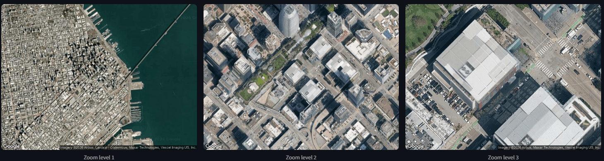
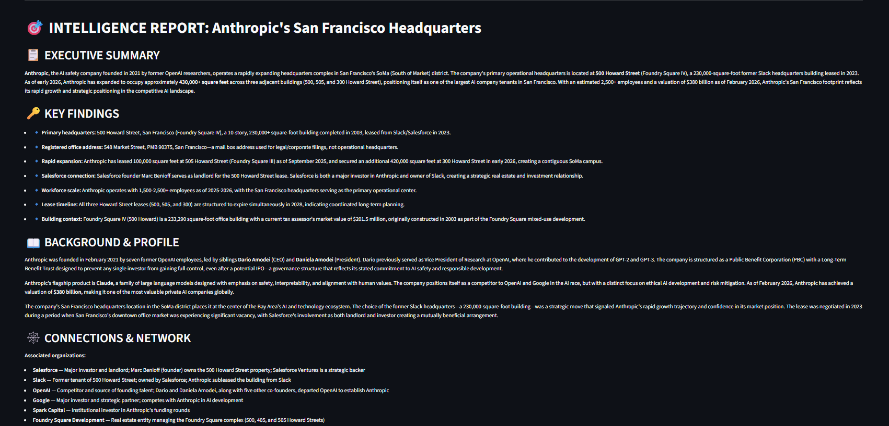

# 🎯 OSINT Intelligence Agent

An autonomous AI agent for open-source intelligence investigations. Takes a target (a person, company, organization, or event) and produces structured intelligence reports pulling from global news, multilingual regional sources, satellite imagery, and persistent memory.



---

## ✨ What It Does

Give it a target, and it autonomously:

- Searches the open web across Google, Bing, Baidu, Yandex, and more
- Scrapes and reads full articles, not just snippets
- Searches in **16 languages** with native-script queries (Chinese, Arabic, Russian, Japanese, Korean, etc.)
- Translates foreign-language content back to English
- Pulls **satellite imagery** at three zoom levels for any associated workplace, campus, or city
- Remembers every investigation across sessions and builds on prior findings
- Correlates facts across sources and flags contradictions
- Produces a structured intelligence report with confidence assessment

---

## 🛰️ Example Output



Ask it to "Investigate Anthropic's San Francisco headquarters" and it returns a full report.

---

## 🏗️ Architecture

```
┌─────────────────────────────────────────────────────┐
│           Streamlit UI  (app.py)                    │
└─────────────────────┬───────────────────────────────┘
                      │
                      ▼
┌─────────────────────────────────────────────────────┐
│   LangGraph Agent  (agent.py)                       │
│   - Claude Haiku brain with 10 tools                │
│   - Auto-triggers multilingual for non-Western      │
└───┬──────┬──────┬──────┬──────┬──────┬─────────────┘
    │      │      │      │      │      │
    ▼      ▼      ▼      ▼      ▼      ▼
┌──────┐┌──────┐┌──────┐┌──────┐┌──────┐┌────────────┐
│News  ││DDGS  ││SearX ││Crawl ││Geo   ││ ChromaDB   │
│API   ││      ││NG    ││4AI   ││Maps  ││ Memory     │
└──────┘└──────┘└──────┘└──────┘└──────┘└────────────┘
```

---

## 🛠️ Tech Stack

- **Agent framework:** LangGraph
- **LLM:** Claude Haiku (Anthropic API)
- **Web search:** DuckDuckGo + self-hosted SearXNG aggregator
- **Regional engines:** Baidu, Yandex, Bing, Google (via SearXNG)
- **Scraping:** Crawl4AI (Playwright under the hood)
- **Translation:** Claude Haiku, 16 languages
- **Vector memory:** ChromaDB with local sentence-transformers embeddings
- **Geospatial:** Google Maps Static API + Geocoding API
- **UI:** Streamlit

---

## 🚀 Setup

### Prerequisites

- Python 3.11
- Conda (or any venv manager)
- Docker Desktop (for self-hosted SearXNG)
- API keys: Anthropic, NewsAPI, Google Maps

### 1. Clone and install

```bash
git clone https://github.com/blaikr/osint-agent.git
cd osint-agent

conda create -n osint-agent python=3.11
conda activate osint-agent

pip install -r requirements.txt
crawl4ai-setup
```

### 2. Add your API keys

```bash
cp .env.example .env
```

Open `.env` and paste your keys:

```
ANTHROPIC_API_KEY=sk-ant-...
NEWSAPI_KEY=...
GOOGLE_MAPS_API_KEY=...
```

### 3. Start SearXNG

```bash
cd searxng
docker compose up -d
```

Verify it's running by visiting [http://localhost:8080](http://localhost:8080).

### 4. Run the agent

Terminal mode:

```bash
python agent.py
```

Dashboard mode:

```bash
streamlit run app.py
```

---

## 💡 Example Queries

```
Research Anthropic
Investigate UT Dallas computer science department
Find information on Xi Jinping's recent policy moves
Research Mohammed bin Salman
What do we know about Dario Amodei
```

Non-Western targets automatically trigger multilingual search across regional engines (Baidu for Chinese, Yandex for Russian, etc.).

---

## 🧠 Memory

Every investigation is saved automatically and persists across sessions. Recall with:

```
what's in memory
what have we investigated
```

Or ask questions like *"what do we know about Anthropic"* — the agent pulls the stored report verbatim without re-investigating.

---

## 📁 Project Structure

```
osint-agent/
├── agent.py              # LangGraph orchestration + tools
├── app.py                # Streamlit dashboard
├── memory.py             # ChromaDB persistent memory
├── translator.py         # Multilingual translation (Claude)
├── searxng_client.py     # Local SearXNG aggregator client
├── geo_tools.py          # Google Maps geocoding + satellite
├── prompts.py            # System prompt for the analyst persona
├── check_memory.py       # Inspect ChromaDB directly
├── requirements.txt
├── .env.example
├── .gitignore
└── searxng/
    ├── docker-compose.yml
    └── settings.yml
```

---

## 🎚️ Design Notes

- **Hallucination safeguards:** Strict system prompt rules that only URLs actually returned by tools can be cited. Fabrication reduced dramatically through iterative prompt design.
- **Programmatic triggering:** Multilingual search fires automatically for non-Western targets rather than relying on the LLM to decide.
- **Memory recall integrity:** Stored reports are quoted verbatim rather than paraphrased, preventing fact corruption over time.
- **Scope boundaries:** Satellite imagery is restricted to professional/public locations; the agent will not pull imagery of private residences.

---

## ⚠️ Scope & Limitations

This tool searches **public, open-source information only**. It cannot and does not:

- Access content behind logins (private social media, paywalled articles)
- Hack, scrape restricted databases, or bypass platform protections
- Access commercial data broker tools (Palantir, LexisNexis, Pipl)
- Guarantee accuracy — every investigation should be human-verified before acting on it

Intended for research, journalism, personal due diligence, and educational use.

---

## 🛣️ Roadmap

- [ ] Autonomous monitoring mode (background loops on saved targets)
- [ ] Fine-tuned local Qwen model for cost-free 24/7 operation
- [ ] Knowledge graph linking entities across investigations
- [ ] PDF ingestion for court filings and archived documents
- [ ] Wayback Machine integration for historical coverage

---

## 👤 Author

Built by [Rami Blaik](https://github.com/blaikr) — CS undergrad at UT Dallas.

Other projects:
- [personalized-llm](https://github.com/blaikr/personalized-llm) — Custom LLM fine-tuning with SFT, IFT, and DPO

---

## 📜 License

Apache 2.0
